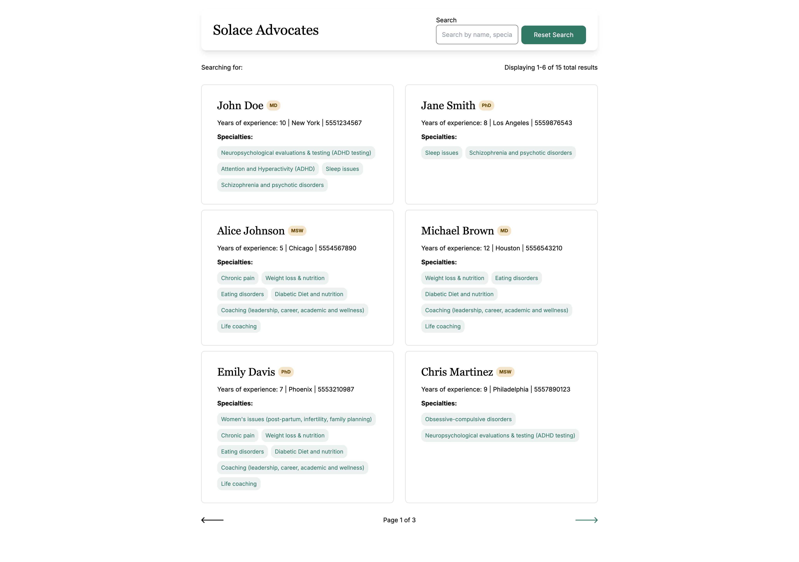
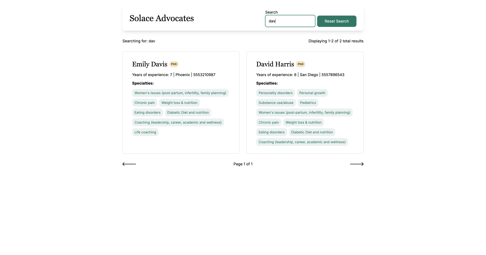

# Discussion

Hi Solace Hiring Team! Thank you for the opportunity to submit this assignment for your review. It was a fun one!

## Future Improvements

### Backend
- **Multi-field search optimization**: Currently, searching "john smith" returns no results because the query searches each field independently. Would implement logic to split search terms and match across multiple fields (e.g., first name AND last name).
- **Cross-field search combinations**: Enable searching across different field types simultaneously (e.g., "smith adhd" to find advocates by name and specialty).

### Frontend
- **Clickable filters**: Make specialty and degree tags clickable to filter results by those criteria.
- **Sorting controls**: Add ability to sort by years of experience (ascending/descending).
- **Phone number formatting**: Format phone numbers from raw bigint (5551234567) to readable format ((555) 123-4567).
- **Location-based sorting**: Implement geolocation to allow sorting by distance from user (would require storing coordinates and user permission for location access).
- **Loading states**: Add a loading indicator during search/pagination transitions.
- **Branding**: Use Solace logo and fonts to had branding consistency across all Solace properties.

### Data
- **Duplicate prevention**: Implement unique constraint on combination of first name, last name, and phone number to prevent duplicate advocate entries.
- **Additional indexes**: Since all fields are searchable, add indexes on `city`, `degree`, and `yearsOfExperience` for better query performance.

## Screenshots

